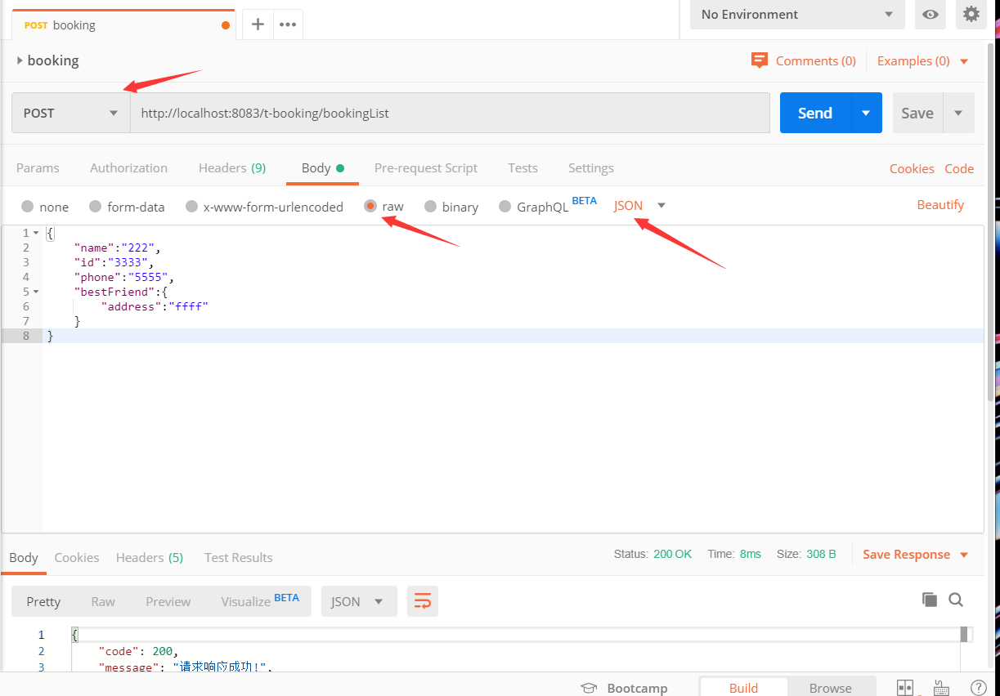
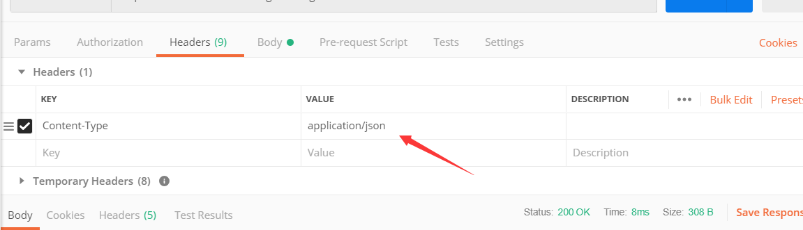
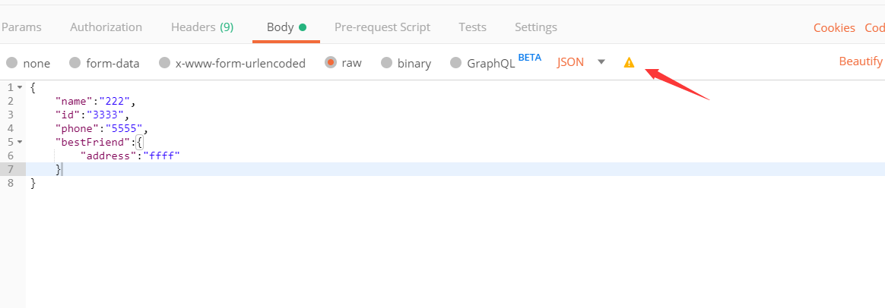
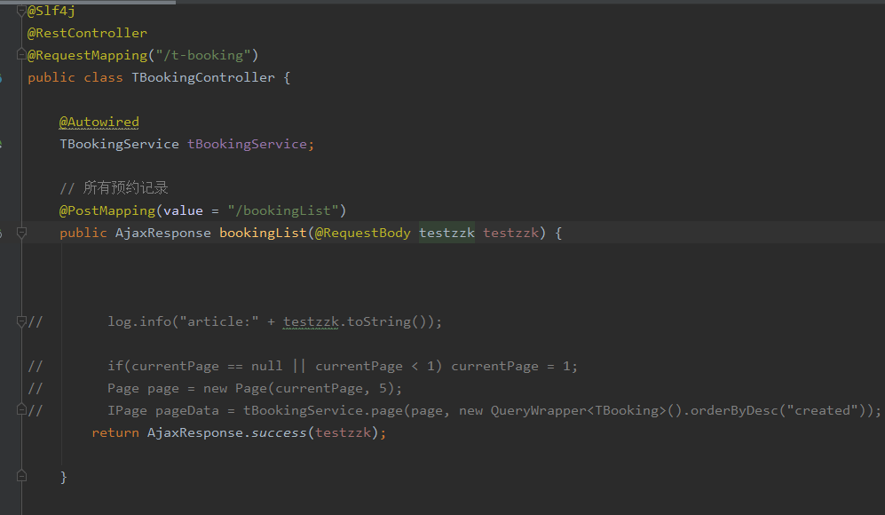
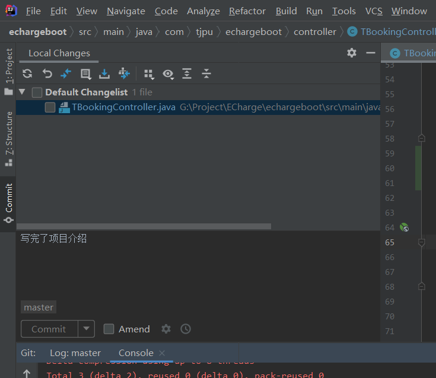

### 2021-1-11 10:38:48

出现的问题是没找到类：


经过一番排查：


这个`chgpleTypeVo`的property没有和实体类的属性名一致，大小写不一致导致的问题。


2021年1月11日16:51:16

今天把service写的差不多了，明天开始写controller层，然后搭建前端框架

### 2021-1-11 19:02:31

有很多要写的，今天发生了很多事情，突然就很想写点东西，搜狗输入法里面中文输入法下输入`sj`就会自动出现当天的具体时间，typora在windows下要开启latex需要设置，在偏好设置里面，设置之后还要重新启动

mybatis修改表结构之后也能正常运作，只要让entity实体类里面的属性字段和表里面的字段对应就行


### 2021-1-12 09:14:30

idea 发现lombok没办法从一个对象里面.get属性名自动提示，最后发现是没装插件。

一会我把自己用过的插件都导出来，方便以后用

昨天想把mac上的idea配置导出，然后 导入到windows上的idea，发现配置全乱套了，以后万万不能这么操作，一定要自己手动配置。


### 2021-1-12 13:24:04

在mysql查询的时候出现了一个问题，就是两张表查询的时候字段重复，报出`Column 'FR_ID' in field list is ambiguous` 这样的错误，解决方法就是给字段写明确的字段名，千万不能写`*` 星号

```sql
 SELECT
		t_chgpile.CP_ID,
		t_chgpile.CP_IP,
		t_chgpile.CP_State,
		t_chgpile.CP_MeterRead,
		t_chgpile.CP_HeartQuantity,
		t_chgpile.CP_El,
		t_chgpile.CP_PayType,
		t_chgpile.CP_BulidDate,
		t_chgpile.CP_DD,
		t_chgpile.CP_Time,
		t_chgpile.CP_OnlineTime,
		t_chgpile.O_ID,
		t_chgpile.FR_ID,
		t_feerate.FR_Name,
		t_station.S_Address,
		t_station.S_Name,
		t_chgpiletype.CPT_Speed,
		t_chgpiletype.CPT_Power
	FROM
		t_chgpile
		INNER JOIN t_feerate ON t_chgpile.FR_ID = t_feerate.FR_ID
		INNER JOIN t_station ON t_chgpile.S_ID = t_station.S_ID
		INNER JOIN t_chgpiletype ON t_chgpile.CPT_ID = t_chgpiletype.CPT_ID
```

### 2021-1-13 15:19:15

postman发送Post请求，请求体里携带json数据，使用row方式，里面的格式选择json



然后请求体里的数据类型要和请求头里的content-type相匹配：



如果不匹配，会在请求体里出现一个黄色的小三角提示，这个时候再选择一下json格式，请求体字段就会自动变更成正确的字段



接受端的代码：




1.从码云上pull项目非常慢，原来是公钥过期了，我之前初始化我的电脑过，所以我用户下的所有东西都没了

码云git生成添加公钥： 

https://gitee.com/help/articles/4181#article-header0

---

git冲突解决测试

冲突场景：本地和线上都修改了同一处代码，线上的代码已经提交到线上仓库，本地提交到本地仓库之后，想要push到线上仓库，代码产生冲突。

解决方案：本地push代码被rejected，只能先pull代码，解决冲突。

通过点击两边的箭头和× 来决定两边的代码谁去谁留


---

2020版idea查看修改过那些文件居然在侧边栏上的commit里，右键点击里面的文件点击rollback就可以回滚到改动之前的样子：



### 2021-1-14 14:11:23

我把这些笔记都导出来了，然后使用git都放到github上了，回来再都放到gitee上，这样我就真正的实现了安全