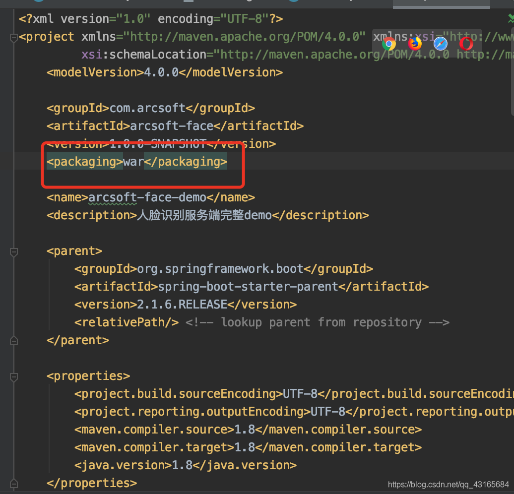
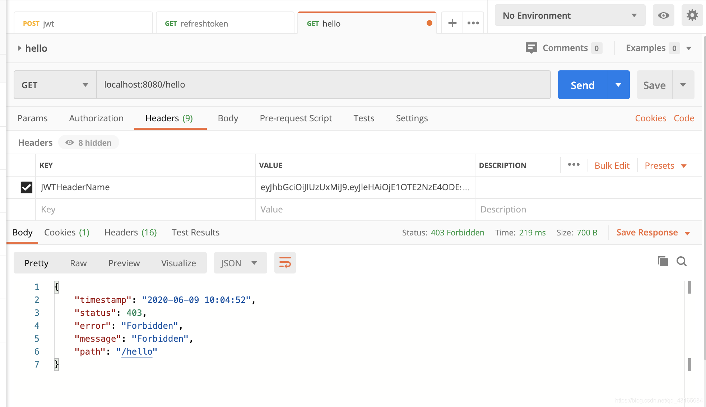
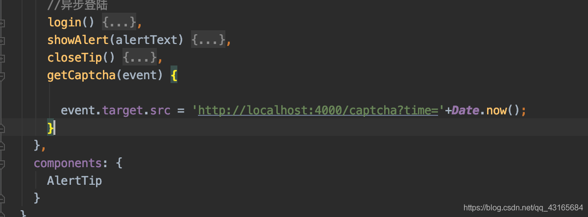

# 开发时遇到的Bug汇总
### 2020-05-25
用Springboot开发的后端接口时候,隔了很长时间启动项目发现了这个问题

原因很简单,一开始以为时端口冲突,但后来看清楚了之后原来是格式对齐的问题

上面的图片`port`没有对齐,应该和下面的`servlet`对齐就没问题了

### 2020-05-28
&emsp;&emsp;之前在我的阿里云服务器上部署过我自己写的框架,基于Spring boot的,现在想换个新的项目,就是我的大数据的作业,但是把之前的项目删除之后换了这个项目放在原来的目录下,访问8080端口,显示的是拒绝访问,换原来的war包就没有问题

&emsp;&emsp;现解决方案是把新的war包改成和原来war包一样的名字,就可以正常访问,原因尚未查明

### 2020-05-29
&emsp;&emsp;想把java项目打包成war包发布,但是一直打成jar包.最后修改pom里的一项就可以


项目发布之后出现如下问题

&emsp;&emsp;打成war包就是这样,解决方案是打成jar包,直接到那个jar包目录下,`java -jar arcsoft-face-1.0.0-SNAPSHOT.jar` .直接裸奔

### 2020-05-30
&emsp;&emsp;在建表的时候出现无效默认的问题,问题如下

&emsp;&emsp;原因是`create_time`的类型不能是`DATE`,必须是`TIMESTAMP` ,改成timestamp类型就没问题了,正确如下

###  2020-05-31
&emsp;&emsp;安装Kali的时候出现“失败的步骤是：选择并安装软件”

我的解决办法是开启全局VPN然后重新安装软件，再把GRUB安装到硬盘
用户名是kalizzk ，密码是123456

### 2020-06-01
&emsp;&emsp;主机无法向kali虚拟中传输文件，具体问题是在传输过程当中总是卡住。
解决问题是将vmware升级到15.0，之前出现问题是因为win10和vmware14不兼容，这里面要注意，安装vmware15的时候要将vmware14删除干净

### 2020-06-02

​		kali 2020无法使用`ifconfig` 命令，因为它需要管理员权限，输入`sudo ifconfig`

---
&emsp;&emsp;org.dozer.MappingException: java.lang.NoClassDefFoundError: javax/xml/bind/JAXBElement
在使用dozer 6.2.0 ,版本的时候出现如下问题

`
org.dozer.MappingException: java.lang.NoClassDefFoundError: javax/xml/bind/JAXBElement`

&emsp;&emsp;经查找资料发现：JAXB API是Java EE API，由于JDK9提出的模块化的概念，导致java.ee模块不再以后的版本里默认提供。当然，还可以通过maven依赖引入他们，例如：

```xml
<dependency>
    <groupId>javax.xml.bind</groupId>
    <artifactId>jaxb-api</artifactId>
    <version>2.3.0</version>
</dependency>
```
---
在一切正常,controller层出现如下问题
`org.apache.ibatis.binding.BindingException: Invalid bound statement (not found): com.itboyst.facedemo.service.HotelRestService.getAll`
原因是这部分写错了


可能会出现的问题


正确写法

### 2020-06-05

登陆成功没有跳转,问题出在ajax忘了把之前写的改了

### 2020-06-06
/smscode接口返回undefined ,原因是没有给他权限访问

一个大bug,在用yanfa1登陆的时候

发现业务一返回异常


经过git版本排查,对比前后版本的diff发现,在biz1的控制器下有方法级的权限控制模型,导致这个页面只能管理员访问

具体实现如下


### 2020-06-07
开始jwt的时候出现如下bug


具体报错如下

```bash
Error starting ApplicationContext. To display the conditions report re-run your application with 'debug' enabled.
[ERROR] 2020-06-07 15:21:11,691 org.springframework.boot.SpringApplication - Application run failed
org.springframework.context.ApplicationContextException: Unable to start web server; nested exception is org.springframework.beans.factory.BeanCreationException: Error creating bean with name 'tomcatServletWebServerFactory' defined in class path resource [org/springframework/boot/autoconfigure/web/servlet/ServletWebServerFactoryConfiguration$EmbeddedTomcat.class]: BeanPostProcessor before instantiation of bean failed; nested exception is org.springframework.beans.factory.BeanCreationException: Error creating bean with name 'metaDataSourceAdvisor': Cannot resolve reference to bean 'methodSecurityMetadataSource' while setting constructor argument; nested exception is org.springframework.beans.factory.BeanCreationException: Error creating bean with name 'org.springframework.security.config.annotation.method.configuration.GlobalMethodSecurityConfiguration': BeanPostProcessor before instantiation of bean failed; nested exception is org.springframework.beans.factory.BeanCreationException: Error creating bean with name 'org.springframework.transaction.annotation.ProxyTransactionManagementConfiguration': Initialization of bean failed; nested exception is java.lang.IllegalArgumentException: error Type referred to is not an annotation type: com$tjpu$jwtserver$config$exception$ModelView
	at org.springframework.boot.web.servlet.context.ServletWebServerApplicationContext.onRefresh(ServletWebServerApplicationContext.java:161) ~[spring-boot-2.3.0.RELEASE.jar:2.3.0.RELEASE]
	at org.springframework.context.support.AbstractApplicationContext.refresh(AbstractApplicationContext.java:544) ~[spring-context-5.2.6.RELEASE.jar:5.2.6.RELEASE]
	at org.springframework.boot.web.servlet.context.ServletWebServerApplicationContext.refresh(ServletWebServerApplicationContext.java:143) ~[spring-boot-2.3.0.RELEASE.jar:2.3.0.RELEASE]
	at org.springframework.boot.SpringApplication.refresh(SpringApplication.java:758) ~[spring-boot-2.3.0.RELEASE.jar:2.3.0.RELEASE]
	at org.springframework.boot.SpringApplication.refresh(SpringApplication.java:750) [spring-boot-2.3.0.RELEASE.jar:2.3.0.RELEASE]
	at org.springframework.boot.SpringApplication.refreshContext(SpringApplication.java:397) [spring-boot-2.3.0.RELEASE.jar:2.3.0.RELEASE]
	at org.springframework.boot.SpringApplication.run(SpringApplication.java:315) [spring-boot-2.3.0.RELEASE.jar:2.3.0.RELEASE]
	at org.springframework.boot.SpringApplication.run(SpringApplication.java:1237) [spring-boot-2.3.0.RELEASE.jar:2.3.0.RELEASE]
	at org.springframework.boot.SpringApplication.run(SpringApplication.java:1226) [spring-boot-2.3.0.RELEASE.jar:2.3.0.RELEASE]
	at com.tjpu.zzkjwt.ZzkjwtApplication.main(ZzkjwtApplication.java:12) [classes/:?]
	at jdk.internal.reflect.NativeMethodAccessorImpl.invoke0(Native Method) ~[?:?]
	at jdk.internal.reflect.NativeMethodAccessorImpl.invoke(NativeMethodAccessorImpl.java:62) ~[?:?]
	at jdk.internal.reflect.DelegatingMethodAccessorImpl.invoke(DelegatingMethodAccessorImpl.java:43) ~[?:?]
	at java.lang.reflect.Method.invoke(Method.java:567) ~[?:?]
	at org.springframework.boot.devtools.restart.RestartLauncher.run(RestartLauncher.java:49) [spring-boot-devtools-2.3.0.RELEASE.jar:2.3.0.RELEASE]
```

当时只看见了这个`Error creating bean with name 'tomcatServletWebServerFactory' `,在网上搜索没有结果,于是看了一下最下面的一行

问题出在这里`error Type referred to is not an annotation type: com$tjpu$jwtserver$config$exception$ModelView` ,然后打开这个文件,发现这是一个注解声明,然后看了一下切面,发现问题所在

把这个改正确之后运行正常

### 2020-06-09
在用postman测试的时候出现如下问题

查看断点,用户认证正常,正常流程走完就是403,再查看controller发现对此接口定义的方法是post,只要把测试改成用post测试就可以

### 2020-06-10
两个日志依赖冲突

解决办法就是

将两个日志依赖全部去掉,用默认日志就很好,默认日志就是彩色的
稍微加一下下面的东西


### 2020-06-16
参数请求,获取相同路径的验证码


### 2020-06-28
写实体类的时候发现没有@NotBlank注释,然后发现没有validation这个包

一开始以为没有引入,后来对比依赖架构图


发现同样是`jakarta.xml.bind-api`的依赖,但是一个就有,一个就没有.于是想到是不是上一层依赖的问题,上一层依赖就是`spring-boot-starter-test`,这两个项目`spring-boot-starter-test`依赖唯一不一样的地方就是版本不同,一个是2.3.1一个是2.2.4,于是我把2.3.1的降为2.2.4就有这个依赖包了.跑起来一切正常,看来以后是不能用太新的东西了

### 2020-06-29


```json
{
    "code": 404,
    "isok": false,
    "message": "操作失败",
    "data": "class com.apache.vblog.shiro.AccountProfile cannot be cast to class com.apache.vblog.shiro.AccountProfile (com.apache.vblog.shiro.AccountProfile is in unnamed module of loader 'app'; com.apache.vblog.shiro.AccountProfile is in unnamed module of loader org.springframework.boot.devtools.restart.classloader.RestartClassLoader @3638a5f2)",
    "timestamp": "2020-06-29 16:01:58"
}
```

我用在shrio里获取用户信息时`SecurityUtils.getSubject().getPrincipal()`这个方法返回的是个object,我把它转成用户DTO,但是它说我转不了,报错信息是`class com.apache.vblog.shiro.AccountProfile cannot be cast to class com.apache.vblog.shiro.AccountProfile` ,气不气人,这两个对象的类型完全一样就是转不了.于是再往下看`(com.apache.vblog.shiro.AccountProfile is in unnamed module of loader 'app'; com.apache.vblog.shiro.AccountProfile is in unnamed module of loader org.springframework.boot.devtools.restart.classloader.RestartClassLoader @3638a5f2)`,这两个对象的classloader 一个是`RestartClassLoader`，一个普通的`AppClassLoader`.我傻了.于是我在Spring Boot的文档spring-boot-devtools 部分，它这么说的

```xml
By default, any open project in your IDE will be loaded using the
“restart” classloader, and any regular .jar file will be loaded using
the “base” classloader. If you work on a multi-module project, and not
each module is imported into your IDE, you may need to customize
things. To do this you can create a
META-INF/spring-devtools.properties file.

The spring-devtools.properties file can contain restart.exclude. and
restart.include. prefixed properties. The include elements are items
that should be pulled up into the “restart” classloader, and the
exclude elements are items that should be pushed down into the “base”
classloader. The value of the property is a regex pattern that will be
applied to the classpath.
```

然后我在WEB-INF里单独给热启动添加一个配置restart.include.shiro-redis=/shiro-[\\w-\\.]+jar,就行了


### 2020-06-30
注意一下,后端千万不要随随便便往外抛异常,没有大事不要抛异常给前端一个bad request 我刚才认识到这点的问题了,业务错误都返回200 ,怎么错的在返回体里说清楚
